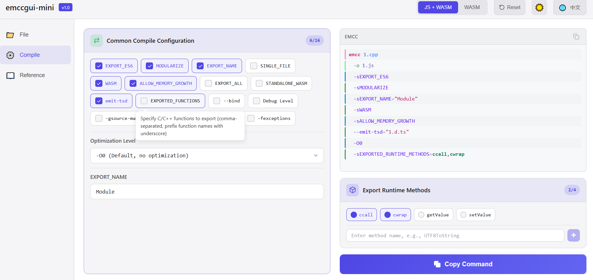
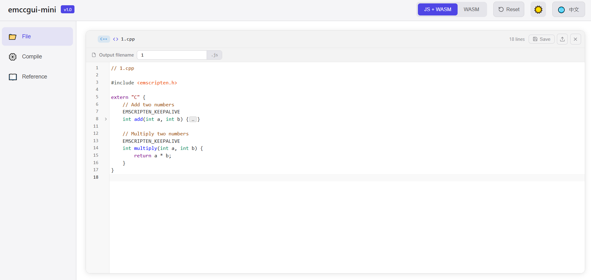

# Emscripten Compiler GUI

**A visual configuration tool that makes WebAssembly compilation effortless**

 

<a href="#-english">English</a>  •  <a href="#-中文">中文</a>

---

 

## 🇬🇧 English

 

### What is Emscripten Compiler GUI?

Emscripten Compiler GUI is a web-based graphical interface for configuring Emscripten (emcc) compiler options. Emscripten is a powerful toolchain for compiling C/C++ to WebAssembly, but with hundreds of command-line flags and options, building the right compilation command can be challenging.

This tool eliminates the need to memorize complex CLI arguments by providing an intuitive visual interface where you can browse, search, and configure compilation options by category. As you configure options, the tool automatically generates the complete emcc command in real-time, ready to copy and use.

 

### ✨ Key Highlights

| Feature | Description |
|:--------|:------------|
| 🎛️ **Visual Option Configuration** | Browse and configure emcc options organized by categories with clear descriptions |
| ⚡ **Real-time Command Generation** | Watch the emcc command build in real-time with one-click copy to clipboard |
| ⚠️ **Conflict Detection** | Automatically detects and warns about mutually exclusive or conflicting options |
| 📖 **Built-in Documentation** | Search and reference comprehensive emcc option documentation within the app |
| 🌐 **Bilingual Interface** | Full support for both English and Chinese UI with seamless language switching |

 

### 📸 Screenshots

<table>
  <tr>
    <td align="center"><b>Configuration Interface</b></td>
    <td align="center"><b>Code Editor</b></td>
  </tr>
  <tr>
    <td></td>
    <td></td>
  </tr>
</table>

 

### 🛠️ Tech Stack

| Technology | Description |
|:-----------|:------------|
| [Vue 3](https://vuejs.org/) | Progressive JavaScript framework with Composition API |
| [TypeScript](https://www.typescriptlang.org/) | Type-safe development experience |
| [Vite](https://vitejs.dev/) | Fast build tool and dev server |
| [CodeMirror 6](https://codemirror.net/) | Advanced code editor with syntax highlighting |
| [Pinia](https://pinia.vuejs.org/) | Intuitive state management |
| [vue-i18n](https://vue-i18n.intlify.dev/) | Internationalization support |

 

### 🌍 Browser Support

| Browser | Support |
|:--------|:--------|
| Chrome | ✅ Recommended |
| Firefox | ✅ Supported |
| Safari | ✅ Supported |
| Edge | ✅ Supported |

 

### 📄 License

This project is open source and available under the **MIT License**.

Free to use for personal and commercial projects.

 

<a href="#-中文">切换到中文 →</a>

---

 

## 🇨🇳 中文

 

### 什么是 Emscripten Compiler GUI？

Emscripten Compiler GUI 是一个基于 Web 的图形化界面，用于配置 Emscripten (emcc) 编译器选项。Emscripten 是将 C/C++ 代码编译为 WebAssembly 的强大工具链，但面对数百个命令行标志和选项，构建正确的编译命令往往令人头疼。

本工具无需记忆复杂的命令行参数，提供直观的可视化界面，你可以按类别浏览、搜索和配置编译选项。配置选项时，工具会实时生成完整的 emcc 命令，一键复制即可使用。

 

### ✨ 核心亮点

| 特性 | 说明 |
|:-----|:-----|
| 🎛️ **可视化选项配置** | 按类别浏览和配置 emcc 编译选项，每个选项都有清晰的说明 |
| ⚡ **实时命令生成** | 切换选项时实时生成 emcc 命令，一键复制到剪贴板 |
| ⚠️ **冲突检测** | 自动检测并警告互斥或冲突的选项，防止生成无效配置 |
| 📖 **内置文档** | 在应用内直接搜索和查阅完整的 emcc 选项文档 |
| 🌐 **双语界面** | 完整支持中英文界面，可随时切换 |

 

### 📸 界面预览

<table>
  <tr>
    <td align="center"><b>编译配置界面</b></td>
    <td align="center"><b>代码编辑器</b></td>
  </tr>
  <tr>
    <td></td>
    <td></td>
  </tr>
</table>

 

### 🛠️ 技术栈

| 技术 | 说明 |
|:-----|:-----|
| [Vue 3](https://vuejs.org/) | 采用 Composition API 的渐进式 JavaScript 框架 |
| [TypeScript](https://www.typescriptlang.org/) | 类型安全的开发体验 |
| [Vite](https://vitejs.dev/) | 快速的构建工具和开发服务器 |
| [CodeMirror 6](https://codemirror.net/) | 支持语法高亮的高级代码编辑器 |
| [Pinia](https://pinia.vuejs.org/) | 直观的状态管理 |
| [vue-i18n](https://vue-i18n.intlify.dev/) | 国际化支持 |

 

### 🌍 浏览器支持

| 浏览器 | 支持情况 |
|:-------|:---------|
| Chrome | ✅ 推荐 |
| Firefox | ✅ 支持 |
| Safari | ✅ 支持 |
| Edge | ✅ 支持 |

 

### 📄 许可证

本项目采用 **MIT 开源协议**。

个人和商业项目均可免费使用。

 

<a href="#-english">Switch to English →</a>

